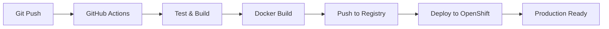

# 🚀 CI/CD Pipeline - Kompletan Setup

Ovaj dokument sadrži pregled svega što je kreirano za automatizovani CI/CD pipeline od lokalnog koda do produkcije na OpenShift.

## 📁 Kreirani Fajlovi

### 1. GitHub Actions Workflow
```
.github/workflows/ci-cd.yml
```
**Funkcija:** Automatski build, test i deployment na OpenShift

**Trigger:** Push u `main` ili `develop` branch

**Jobs:**
- ✅ **Test** - Node.js setup, pnpm install, build
- ✅ **Build & Push** - Docker build i push na GitHub Container Registry
- ✅ **Deploy** - Automatski deployment na OpenShift

### 2. Helm Chart za OpenShift
```
helm/
├── Chart.yaml              # Chart metadata
├── values.yaml             # Konfiguracija
├── templates/
│   ├── deployment.yaml     # Kubernetes deployment
│   ├── service.yaml        # Kubernetes service
│   ├── ingress.yaml        # HTTPS ingress
│   ├── route.yaml          # OpenShift route
│   ├── serviceaccount.yaml # Service account
│   └── _helpers.tpl       # Helper funkcije
```

**Funkcija:** Kubernetes/OpenShift deployment konfiguracija

**Features:**
- 🔒 Security context (non-root user)
- 📈 Horizontal Pod Autoscaler (2-10 replicas)
- 🌐 HTTPS ingress sa cert-manager
- 🛣️ OpenShift Route support
- 💾 Resource limits i requests

### 3. Deployment Skripte
```
deploy-openshift.sh         # Automatski deployment na OpenShift
```

**Funkcija:** Jednostavna komanda za deployment

**Usage:**
```bash
./deploy-openshift.sh latest
```

### 4. Dokumentacija
```
OPENSHIFT-DEPLOYMENT.md     # Detaljno uputstvo za OpenShift
GITHUB-SETUP.md            # GitHub Secrets setup
CI-CD-SUMMARY.md           # Ovaj dokument
```

## 🔄 CI/CD Flow



## 🚀 Kako Pokrenuti

### 1. Prvi put setup
```bash
# 1. Podesi GitHub Secrets
# - OPENSHIFT_SERVER_URL
# - OPENSHIFT_TOKEN

# 2. Push u main branch
git add .
git commit -m "Add CI/CD pipeline"
git push origin main
```

### 2. Automatski deployment
- **GitHub Actions** će se automatski pokrenuti
- **Docker image** će biti build-ovan i push-ovan
- **OpenShift deployment** će se automatski izvršiti

### 3. Ručni deployment
```bash
# Koristi deploy skriptu
./deploy-openshift.sh latest

# Ili ručno sa Helm
helm upgrade --install cn-docs ./helm --namespace cn-docs
```

## 🔐 Potrebni Secrets

### GitHub Repository Secrets
```
OPENSHIFT_SERVER_URL=https://api.your-cluster.com:6443
OPENSHIFT_TOKEN=sha256~your-token-here
```

### Kako dobiti OpenShift token
```bash
# Login na OpenShift
oc login

# Kopiraj token
oc whoami -t
```

## 🌐 Production URL

Nakon uspešnog deployment-a, aplikacija će biti dostupna na:

- **OpenShift Route:** `https://docs.cloudnative.rs`
- **Ingress:** `https://docs.cloudnative.rs` (sa HTTPS)

## 📊 Monitoring

### 1. GitHub Actions
- **Actions** tab → workflow status
- **Packages** tab → Docker image

### 2. OpenShift
```bash
# Proveri status
oc get pods -n cn-docs
oc get routes -n cn-docs
oc get events -n cn-docs

# Pogledaj logove
oc logs -f deployment/cn-docs -n cn-docs
```

## 🔧 Customizacija

### 1. Promeni branch trigger
```yaml
# .github/workflows/ci-cd.yml
on:
  push:
    branches: [ main, develop, staging ]
```

### 2. Dodaj environment
```yaml
deploy-to-openshift:
  environment: production
  # ... ostali koraci
```

### 3. Promeni OpenShift project
```yaml
oc new-project my-project-name
```

## 🧹 Cleanup

### 1. Obriši deployment
```bash
# Helm uninstall
helm uninstall cn-docs -n cn-docs

# Obriši projekat
oc delete project cn-docs
```

### 2. Obriši Docker image
```bash
docker rmi cn-docs:latest
```

## 🔍 Troubleshooting

### Česti problemi i rešenja

#### 1. Workflow neće da se pokrene
- ✅ Proveri da li je push u `main` branch
- ✅ Proveri da li `.github/workflows/ci-cd.yml` postoji

#### 2. Docker build ne uspeva
- ✅ Proveri `Dockerfile`
- ✅ Testiraj lokalno: `docker build -t test .`

#### 3. OpenShift deployment ne uspeva
- ✅ Proveri GitHub Secrets
- ✅ Proveri OpenShift token permisije
- ✅ Proveri cluster resurse

#### 4. Helm chart greške
- ✅ Proveri chart: `helm lint ./helm`
- ✅ Test template: `helm template cn-docs ./helm`

## 📚 Korisni linkovi

- [GitHub Actions](https://docs.github.com/en/actions)
- [OpenShift CLI](https://docs.openshift.com/container-platform/latest/cli_reference/)
- [Helm Documentation](https://helm.sh/docs/)
- [Kubernetes](https://kubernetes.io/docs/)

## 🎯 Sledeći koraci

1. **Podesi GitHub Secrets** u repository settings
2. **Push-uj kod** u main branch
3. **Proveri GitHub Actions** - trebalo bi da se pokrene
4. **Proveri OpenShift deployment** - `oc get pods -n cn-docs`
5. **Pristupi aplikaciji** - preko OpenShift Route

## 🆘 Support

Za probleme:

1. **GitHub Actions logs** - Actions tab → workflow → job
2. **OpenShift status** - `oc get events -n cn-docs`
3. **Helm status** - `helm status cn-docs -n cn-docs`
4. **Docker test** - `docker build -t test .`

---

**🎉 Čestitam! Sada imaš kompletan CI/CD pipeline koji automatski deploy-uje tvoju aplikaciju na OpenShift!**
