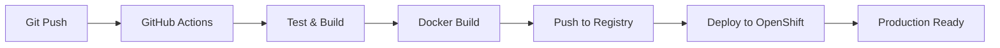

# Cloud Native Documentation 📚

Comprehensive documentation for Cloud Native technologies, deployment strategies, operations, and sales resources with **automated CI/CD pipeline** for OpenShift deployment.

[](https://github.com/Cloud-Native-RS/docs-cloudnative.rs/actions)
[](https://github.com/Cloud-Native-RS/docs-cloudnative.rs/packages)
[](https://docs.cloudnative.rs)
[](https://opensource.org/licenses/MIT)

## 🌟 Features

### 🚀 **CI/CD Pipeline**
- **Automated deployment** to OpenShift on every push to main branch
- **GitHub Actions** workflow for testing, building, and deployment
- **Docker containerization** with multi-stage builds
- **Helm charts** for Kubernetes/OpenShift deployment
- **Automatic scaling** with Horizontal Pod Autoscaler

### 📖 **Documentation**
- **Get Started** - Introduction to Cloud Native concepts and getting started guide
- **Deployment** - Deployment strategies, architecture, and best practices
- **Operations** - Cluster management, monitoring, and security
- **Resources** - Tools, scripts, documentation, and best practices

### 🎯 **Projects & Sales**
- **Project EDU/POC** - Educational and Proof of Concept projects
- **Sales** - Business resources, services, and pricing models

### 🔗 **Useful Links**
- [Live Site](https://docs.cloudnative.rs) - Production deployment
- [Contact](https://cloud-native.rs/contact) - Contact information
- [GitHub](https://github.com/cloud-native-serbia) - Our GitHub repository
- [Kubernetes Docs](https://kubernetes.io/docs/) - Official Kubernetes documentation
- [OpenShift Docs](https://docs.openshift.com/) - Official OpenShift documentation

## 🛠 Technologies

- **Frontend:** Next.js 18 + Nextra Theme + MDX
- **Styling:** CSS Modules + Tailwind CSS
- **Containerization:** Docker + Multi-stage builds
- **Orchestration:** Kubernetes + OpenShift + Helm
- **CI/CD:** GitHub Actions + GitHub Container Registry
- **Deployment:** OpenShift Routes + Ingress + HTTPS

## 🚀 Quick Start

### 1. **Local Development**
```bash
# Clone the repository
git clone https://github.com/Cloud-Native-RS/docs-cloudnative.rs.git
cd docs-cloudnative.rs

# Install dependencies
pnpm install

# Start development server
pnpm dev
```

### 2. **Docker Local Testing**
```bash
# Build and run with Docker
docker-compose up --build

# Or manually
docker build -t cn-docs:latest .
docker run -p 3000:3000 cn-docs:latest
```

### 3. **OpenShift Deployment**
```bash
# Deploy to OpenShift
./deploy-openshift.sh latest

# Or manually with Helm
helm upgrade --install cn-docs ./helm --namespace cn-docs
```

## 🔄 CI/CD Pipeline

### **Automated Workflow**


### **Pipeline Stages**
1. **🔄 Test** - Node.js setup, dependency installation, build verification
2. **🏗️ Build** - Docker image creation with multi-stage optimization
3. **📦 Push** - Automatic push to GitHub Container Registry
4. **🚀 Deploy** - Helm-based deployment to OpenShift cluster

### **Trigger Conditions**
- **Automatic:** Push to `main` or `develop` branches
- **Manual:** GitHub Actions manual trigger
- **Scheduled:** Daily deployment checks (configurable)

## 🐳 Docker & Containerization

### **Multi-stage Dockerfile**
```dockerfile
# Optimized for production with:
# - Node.js 18 Alpine base
# - Multi-stage build process
# - Non-root user security
# - Standalone Next.js output
# - Minimal final image size
```

### **Local Docker Commands**
```bash
# Build image
docker build -t cn-docs:latest .

# Run container
docker run -p 3000:3000 cn-docs:latest

# View logs
docker logs <container-id>

# Stop container
docker stop <container-id>
```

## ☸️ OpenShift & Kubernetes

### **Helm Chart Features**
- **Security:** Non-root user, read-only filesystem
- **Scaling:** Horizontal Pod Autoscaler (2-10 replicas)
- **Networking:** OpenShift Routes + Ingress with HTTPS
- **Resources:** CPU/Memory limits and requests
- **Monitoring:** Health checks and readiness probes

### **Deployment Commands**
```bash
# Check OpenShift connection
oc whoami
oc get projects

# Deploy application
./deploy-openshift.sh latest

# Monitor deployment
oc get pods -n cn-docs
oc get routes -n cn-docs
oc logs -f deployment/cn-docs -n cn-docs
```

### **Production Features**
- **HTTPS:** Automatic SSL certificates with cert-manager
- **Load Balancing:** OpenShift Route with edge termination
- **Auto-scaling:** Based on CPU and memory usage
- **High Availability:** Multi-replica deployment across nodes

## 📁 Project Structure

```
cn-docs/
├── .github/workflows/      # CI/CD pipeline configuration
│   └── ci-cd.yml          # GitHub Actions workflow
├── helm/                   # OpenShift/Kubernetes deployment
│   ├── Chart.yaml         # Helm chart metadata
│   ├── values.yaml        # Configuration values
│   └── templates/         # Kubernetes manifests
├── pages/                  # MDX pages and routing
│   ├── _meta.json         # Navigation configuration
│   ├── index.mdx          # Home page
│   ├── deployment/        # Deployment documentation
│   ├── operations/        # Operations documentation
│   ├── resources/         # Resources and tools
│   ├── projects/          # Projects (EDU/POC)
│   └── sales/            # Sales materials
├── components/            # React components
├── public/               # Static files (images, icons)
├── theme.config.tsx      # Nextra theme configuration
├── next.config.js        # Next.js configuration
├── Dockerfile            # Multi-stage Docker build
├── docker-compose.yml    # Local development setup
├── deploy-openshift.sh   # OpenShift deployment script
└── package.json          # Dependencies and scripts
```

## 🔧 Configuration

### **Environment Variables**
```bash
# Production
NODE_ENV=production
NEXT_TELEMETRY_DISABLED=1
PORT=3000
HOSTNAME=0.0.0.0

# Development
NODE_ENV=development
PORT=3000
```

### **Helm Values**
```yaml
# Customize deployment
replicaCount: 2
resources:
  limits:
    cpu: 500m
    memory: 512Mi
  requests:
    cpu: 250m
    memory: 256Mi
```

## 📝 Adding New Content

### **Creating a new page**
1. Create a new `.mdx` file in the appropriate directory under `pages/`
2. Update the `_meta.json` file to add the new page to navigation
3. Follow the existing content structure and formatting

### **Example _meta.json structure**
```json
{
  "index": "Overview",
  "new-page": "New Page",
  "subfolder": "Subfolder Name"
}
```

### **Adding separators and external links**
```json
{
  "---section": {
    "type": "separator", 
    "title": "Section Title"
  },
  "external-link": {
    "title": "External Link ↗",
    "href": "https://example.com",
    "newWindow": true
  }
}
```

## 🎨 Customization

- **Theme:** Modify `theme.config.tsx` for logo, title, footer, etc.
- **Styles:** Add custom CSS in the `components/` directory
- **Components:** Create reusable React components
- **Deployment:** Customize Helm values in `helm/values.yaml`
- **CI/CD:** Modify `.github/workflows/ci-cd.yml`

## 🚀 Deployment Options

### **1. Local Development**
```bash
pnpm dev          # Development server
pnpm build        # Production build
pnpm start        # Production server
```

### **2. Docker Local**
```bash
docker-compose up --build    # Build and run
docker-compose down          # Stop services
```

### **3. OpenShift Production**
```bash
./deploy-openshift.sh latest    # Automated deployment
```

### **4. Manual Kubernetes**
```bash
helm upgrade --install cn-docs ./helm --namespace cn-docs
```

## 🔍 Monitoring & Troubleshooting

### **Health Checks**
```bash
# Pod status
oc get pods -n cn-docs

# Service endpoints
oc get endpoints -n cn-docs

# Route status
oc get routes -n cn-docs

# Events
oc get events -n cn-docs
```

### **Logs & Debugging**
```bash
# Application logs
oc logs -f deployment/cn-docs -n cn-docs

# Pod details
oc describe pod <pod-name> -n cn-docs

# Port forwarding for debugging
oc port-forward svc/cn-docs 3000:3000 -n cn-docs
```

### **Common Issues**
- **Build failures:** Check Docker build locally
- **Deployment issues:** Verify OpenShift permissions
- **Image pull errors:** Check container registry access
- **Route problems:** Verify DNS and SSL configuration

## 🤝 Contributing

### **Development Workflow**
1. Fork the repository
2. Create a feature branch (`git checkout -b feature/new-feature`)
3. Make your changes and test locally
4. Commit your changes (`git commit -am 'Add new feature'`)
5. Push to the branch (`git push origin feature/new-feature`)
6. Open a Pull Request

### **CI/CD Integration**
- All PRs automatically trigger CI/CD pipeline
- Automated testing and build verification
- Deployment previews available
- Production deployment on merge to main

## 📚 Documentation

- **[CI/CD Summary](CI-CD-SUMMARY.md)** - Complete pipeline overview
- **[OpenShift Deployment](OPENSHIFT-DEPLOYMENT.md)** - Detailed deployment guide
- **[GitHub Setup](GITHUB-SETUP.md)** - CI/CD configuration guide
- **[Docker Compose](docker-compose.yml)** - Local development setup

## 📄 License

This project is licensed under the MIT License. See the [LICENSE](LICENSE) file for details.

## 📞 Contact & Support

- **🌐 Website:** [cloud-native.rs](https://cloud-native.rs)
- **📚 Live Docs:** [docs.cloudnative.rs](https://docs.cloudnative.rs)
- **🐙 GitHub:** [cloud-native-serbia](https://github.com/cloud-native-serbia)
- **📧 Contact:** [Contact page](https://cloud-native.rs/contact)
- **🚀 CI/CD:** [GitHub Actions](https://github.com/Cloud-Native-RS/docs-cloudnative.rs/actions)

## 🎯 Roadmap

- [ ] **Multi-environment deployment** (dev, staging, prod)
- [ ] **Advanced monitoring** with Prometheus and Grafana
- [ ] **Blue-green deployment** strategies
- [ ] **Performance testing** integration
- [ ] **Security scanning** in CI/CD pipeline
- [ ] **Backup and disaster recovery** procedures

---

**Built with ❤️ for the Cloud Native community in Serbia**

*Powered by Next.js, Docker, OpenShift, and automated CI/CD pipeline*