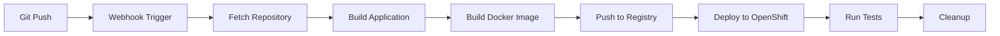

# 🚀 OpenShift Tekton CI/CD Pipeline

Ovaj dokument opisuje kako koristiti OpenShift Tekton pipeline za CI/CD umesto GitHub Actions.

## 🌟 **Prednosti Tekton Pipeline-a**

### **🔧 OpenShift Native**
- **Integrisan** sa OpenShift platformom
- **Kubernetes native** - koristi standardne K8s resurse
- **Auto-scaling** - pipeline-ovi se pokreću kao podovi
- **Resource management** - koristi OpenShift resource quotas

### **🚀 Performanse**
- **Parallel execution** - više task-ova može da radi paralelno
- **Caching** - workspace-ovi se mogu cache-ovati
- **Distributed execution** - task-ovi se pokreću na različitim node-ovima
- **Resource optimization** - dinamički resource allocation

### **🔒 Security**
- **ServiceAccount** - svaki pipeline ima svoj SA
- **RBAC** - granularne permisije
- **Pod security** - pipeline-ovi se pokreću u sigurnim pod-ovima
- **Secret management** - integrisan sa OpenShift secrets

## 🏗️ **Pipeline Arhitektura**

### **Pipeline Stages**


### **Task Breakdown**
1. **🔍 fetch-repository** - Git clone
2. **🏗️ build-application** - Node.js build
3. **🐳 build-image** - Docker build sa Buildah
4. **📦 push-image** - Push na OpenShift registry
5. **🚀 deploy-openshift** - Helm deployment
6. **🧪 run-tests** - Test execution
7. **🧹 cleanup** - Workspace cleanup

## 🚀 **Kako Pokrenuti**

### **1. Prerequisites**
```bash
# OpenShift CLI
brew install openshift-cli

# Login na OpenShift
oc login --token=<your-token> --server=<your-server>

# Proveri da li je Tekton instaliran
oc get crd pipelineruns.tekton.dev
```

### **2. Deploy Pipeline**
```bash
# Napravi deploy skriptu executable
chmod +x deploy-tekton-pipeline.sh

# Deploy pipeline
./deploy-tekton-pipeline.sh
```

### **3. Manual Pipeline Run**
```bash
# Pokreni pipeline ručno
oc apply -f tekton/pipelinerun.yaml

# Proveri status
oc get pipelineruns -n cn-docs
```

## 🔧 **Konfiguracija**

### **Pipeline Parameters**
```yaml
params:
  - name: git-url
    default: "https://github.com/Cloud-Native-RS/docs-cloudnative.rs.git"
  - name: git-revision
    default: "main"
  - name: image-repository
    default: "image-registry.openshift-image-registry.svc:5000/cn-docs"
  - name: image-tag
    default: "latest"
  - name: project-name
    default: "cn-docs"
```

### **Workspace Configuration**
```yaml
workspaces:
  - name: shared-workspace
    volumeClaimTemplate:
      spec:
        accessModes:
          - ReadWriteOnce
        resources:
          requests:
            storage: 1Gi
```

## 🎯 **Automatizacija sa GitHub Webhooks**

### **1. GitHub Webhook Setup**
```
URL: https://your-openshift-route/webhook
Content-Type: application/json
Secret: your-github-webhook-secret
Events: Just the push event
```

### **2. Webhook Secret**
```bash
# Kreiraj secret
oc create secret generic github-webhook-secret \
  --from-literal=secretToken="your-actual-secret" \
  -n cn-docs

# Ažuriraj secret
oc patch secret github-webhook-secret -n cn-docs \
  --type='json' \
  -p='[{"op": "replace", "path": "/data/secretToken", "value": "base64-encoded-secret"}]'
```

### **3. EventListener Configuration**
```yaml
apiVersion: triggers.tekton.dev/v1alpha1
kind: EventListener
metadata:
  name: cn-docs-event-listener
spec:
  triggers:
    - name: cn-docs-git-trigger
      interceptors:
        - ref:
            name: "github"
          params:
            - name: "secretRef"
              value:
                secretName: github-webhook-secret
                secretKey: secretToken
            - name: "eventTypes"
              value: ["push"]
```

## 📊 **Monitoring i Debugging**

### **Pipeline Status**
```bash
# Proveri pipeline runs
oc get pipelineruns -n cn-docs

# Proveri task runs
oc get taskruns -n cn-docs

# Proveri podove
oc get pods -n cn-docs -l tekton.dev/taskRun
```

### **Logs i Debugging**
```bash
# Pipeline run logs
oc logs -f pipelinerun/<name> -n cn-docs

# Task run logs
oc logs -f taskrun/<name> -n cn-docs

# Pod logs
oc logs -f pod/<name> -n cn-docs

# Exec u pod
oc exec -it <pod-name> -n cn-docs -- /bin/sh
```

### **Events i Troubleshooting**
```bash
# Proveri events
oc get events -n cn-docs --sort-by='.lastTimestamp'

# Proveri pipeline spec
oc get pipeline cn-docs-pipeline -n cn-docs -o yaml

# Proveri trigger status
oc get eventlistener -n cn-docs
```

## 🔍 **Česti Problemi i Rešenja**

### **1. Pipeline neće da se pokrene**
```bash
# Proveri da li je Tekton instaliran
oc get crd pipelineruns.tekton.dev

# Proveri da li su svi CRD-ovi instalirani
oc get crd | grep tekton

# Proveri da li su task-ovi dostupni
oc get task -n openshift-pipelines
```

### **2. Task neće da se izvrši**
```bash
# Proveri da li su task-ovi instalirani
oc get task -n openshift-pipelines

# Proveri da li su task-ovi u namespace-u
oc get task -n cn-docs

# Proveri task spec
oc get task <task-name> -n cn-docs -o yaml
```

### **3. Webhook ne radi**
```bash
# Proveri EventListener status
oc get eventlistener -n cn-docs

# Proveri EventListener pod
oc get pods -n cn-docs -l app=cn-docs-event-listener

# Proveri EventListener logs
oc logs -f deployment/cn-docs-event-listener -n cn-docs
```

### **4. Permission issues**
```bash
# Proveri ServiceAccount
oc get serviceaccount -n cn-docs

# Proveri RoleBinding
oc get rolebinding -n cn-docs

# Proveri Role
oc get role -n cn-docs
```

## 🚀 **Advanced Features**

### **1. Parallel Execution**
```yaml
# Više task-ova može da radi paralelno
- name: parallel-task-1
  runAfter: ["fetch-repository"]
- name: parallel-task-2
  runAfter: ["fetch-repository"]
- name: merge-task
  runAfter: ["parallel-task-1", "parallel-task-2"]
```

### **2. Conditional Execution**
```yaml
# Task se izvršava samo ako je uslov ispunjen
- name: conditional-task
  when:
    - input: "$(params.environment)"
      operator: in
      values: ["staging", "production"]
```

### **3. Workspace Sharing**
```yaml
# Deljenje workspace-a između task-ova
workspaces:
  - name: shared-workspace
    volumeClaimTemplate:
      spec:
        accessModes:
          - ReadWriteMany
        storageClassName: nfs-storage
```

### **4. Resource Limits**
```yaml
# Resource limits za pipeline
spec:
  resources:
    requests:
      memory: "1Gi"
      cpu: "500m"
    limits:
      memory: "2Gi"
      cpu: "1000m"
```

## 📚 **Korisni Linkovi**

- [OpenShift Pipelines Documentation](https://docs.openshift.com/container-platform/latest/cicd/pipelines/understanding-openshift-pipelines.html)
- [Tekton Documentation](https://tekton.dev/docs/)
- [OpenShift CLI Reference](https://docs.openshift.com/container-platform/latest/cli_reference/openshift_cli/)
- [Kubernetes RBAC](https://kubernetes.io/docs/reference/access-authn-authz/rbac/)

## 🆘 **Support**

Za probleme sa Tekton pipeline-om:

1. **Proveri Tekton status** - `oc get pods -n openshift-pipelines`
2. **Proveri pipeline logs** - `oc logs -f pipelinerun/<name> -n cn-docs`
3. **Proveri events** - `oc get events -n cn-docs`
4. **Proveri RBAC** - `oc get rolebinding -n cn-docs`

---

**🎉 Tekton pipeline ti daje enterprise-grade CI/CD direktno na OpenShift platformi!**
